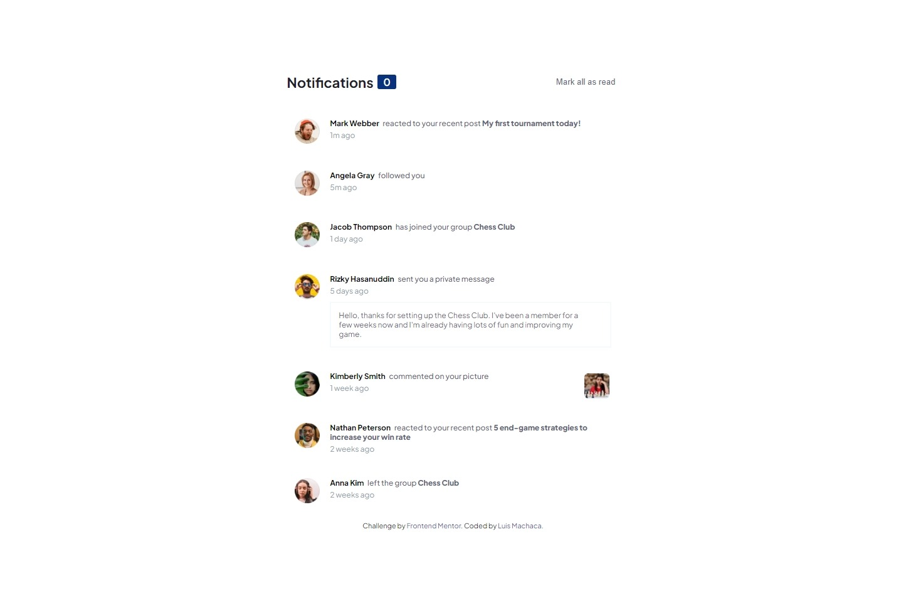

# Frontend Mentor - Notifications page solution

This is a solution to the [Notifications page challenge on Frontend Mentor](https://www.frontendmentor.io/challenges/notifications-page-DqK5QAmKbC). Frontend Mentor challenges help you improve your coding skills by building realistic projects.

## Table of contents

- [Overview](#overview)
  - [The challenge](#the-challenge)
  - [Screenshot](#screenshot)
  - [Links](#links)
- [My process](#my-process)
  - [Built with](#built-with)
  - [What I learned](#what-i-learned)
  - [Continued development](#continued-development)
  - [Useful resources](#useful-resources)
- [Author](#author)
- [Acknowledgments](#acknowledgments)

## Overview

### The challenge

Users should be able to:

- Distinguish between "unread" and "read" notifications
- Select "Mark all as read" to toggle the visual state of the unread notifications and set the number of unread messages to zero
- View the optimal layout for the interface depending on their device's screen size
- See hover and focus states for all interactive elements on the page

### Screenshot

### Links

- Solution URL: [Add solution URL here](https://your-solution-url.com)
- Live Site URL: [Add live site URL here](https://your-live-site-url.com)

## My process

### Built with

- Semantic HTML5 markup
- CSS custom properties
- Flexbox
- Mobile-first workflow
- utility class
- javascript
- BEM Naming

### What I learned

Through the development of this challenge I was able to reinforce my knowledge of HTML and CSS and go over basic Javscript concepts.

### Continued development

At some point in the future I can do this same challenge only with javascript since I think that the templates of the notifications could be generated easier with javascript instead of putting everything with html or it would also be an option to make web components for this challenge.

### Useful resources

- [media-hover](https://developer.mozilla.org/en-US/docs/Web/CSS/@media/hover)- An understandable guide to know a little more about the Medium Hover function
- [css-selectors](https://developer.mozilla.org/es/docs/Web/CSS/CSS_Selectors)- A complete guide to learn about the use case of each CSS selector
- [utility-classes-tailwindcss](https://tailwindcss.com/docs/installation)- This is official TailwindCSS guide to naming my utility classes inspires me in the class names in TailwindCSS.
-[min-css](https://developer.mozilla.org/en-US/docs/Web/CSS/min)- This is a guide for learning the use de css function  min.

## Author

- Linkedin - [luismachaca](https://www.linkedin.com/in/luismachaca)
- Frontend Mentor - [@luismacode](https://www.frontendmentor.io/profile/luismacode)
- Twitter - [@luismacode](https://www.twitter.com/luismacode)
